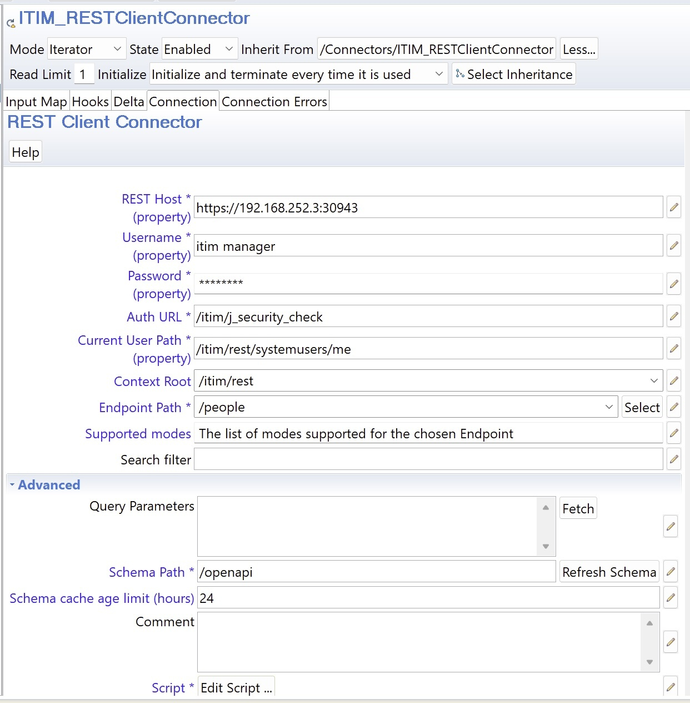
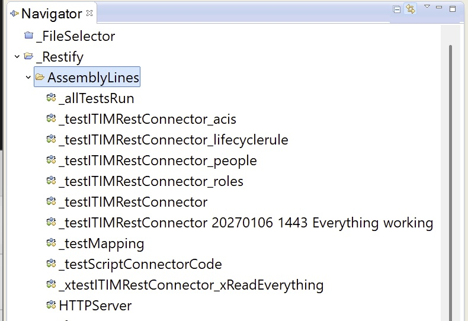
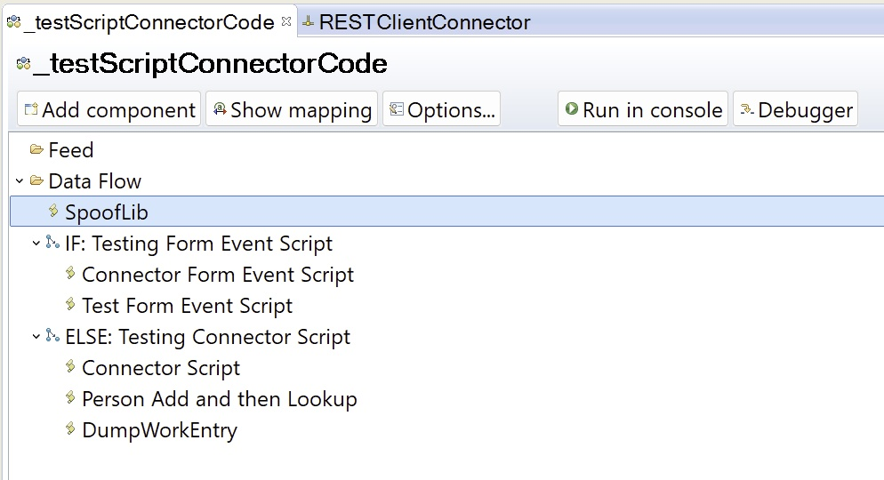

# IBM Directory Integrator REST Connector - User Guide

## Overview

**Version**: 7.2
**Started**: August 25, 2024
**Last Modified**: January 12, 2026
**Author**: eddiehartman@gmail.com (before you email me, read on)

The best place to ask questions and take part is through the [Community Forum](https://discord.gg/QaaUfWvS6J), restclient-connector thread. See you there :)

---

## Table of Contents

DON'T PANIC!! These sections are all brief and hopefully make using this component straightforward. If not, I want to hear about it!

1. [Key Features](#key-features)
2. [Architecture Overview](#architecture-overview)
3. [Where To Start](#getting-started)
4. [Connector Configuration](#connector-configuration)
5. [Using the ITIMRestClientConnector](#using-the-itimrestclientconnector)
6. [Core Classes and Scripts](#core-classes-and-scripts)
7. [Best Practices](#best-practices)
8. [Troubleshooting](#troubleshooting)
9. [AssemblyLines](#assemblylines)
10. [Final Note](#final-note)

---

## Key Features

### 1. **OpenAPI Schema Integration**

- Automatic retrieval and parsing of the OpenAPI schemas (JSON/YAML)
- Dynamic endpoint discovery
- Discovery of Connector Modes supported by the selected Endpoint
- Automatic parameter detection and validation
- Schema caching with configurable age limit (Hours - default is 24)

### 2. **Dynamic Form-Based Configuration**

- Interactive form with dropdown menus populated from schema
- Select button to retrieve endpoints, supported Connector modes and prescribed parameters
- Automatic case correction for mapped Attributes, so 'ruletype' == 'ruleType'
- Context roots (e.g. '/v2.1') read from schema and provided in dropdown
  NOTE: The user must select the root context that supports the Endpoint being processed. Some Endpoints may require specific versions of the REST Service.

### 3. **Full CRUD Operations Support**

For supported Connector Modes:

- **Iterator Mode**: GET operations for listing/searching
- **Lookup Mode**: GET operations for single item retrieval
- **AddOnly Mode**: POST operations for creating new items
- **Update Mode**: POST/PUT operations for modifications
- **Delete Mode**: DELETE operations

### 4. **Authentication & Security**

- Username/password authentication
- API key support
- CSRF token handling
- Cookie management
- Session persistence

### 5. **Reusable/Example Assets**

- The REST Client Connector itself
- Script libraries - i.e. JavaScript classes ala Douglas Crockford (RESTCLIENT, SCHEMA)
- Attribute mapping templates for ITIM test ALs, outlining a particular mapping script needed as described in the [AssemblyLines](#assemblylines) section
- Test AssemblyLines for validation with ITIM, showing Error Handling, Multiple Entries Found and other Hook scripting techniques

---

## Architecture Overview

### Component Structure

```
_Restify.xml
├── AssemblyLines/          # Workflow definitions
│   ├── _testScriptConnectorCode
│   ├── _testITIMRestConnector
│   ├── _testITIMRestConnector_people
│   ├── _testITIMRestConnector_lifecyclerule
│   ├── _testITIMRestConnector_acis
│   └── _testITIMRestConnector_roles
├── Connectors/             # Connector definitions
│   └── RestClientConnector      NOTE: There is also an ITIMRESTConnector based on it, configured via _Restify/Resources/Properties
├── Scripts/                # JavaScript libraries
│   ├── RESTCLIENT class        JavaScript Class that wraps REST Client communications
│   ├── SCHEMA class            JavaScript Class for parsing and searching in an OpenAPI schema
│   └── Example scripts
└── AttributeMaps/          # Data mapping templates
    ├── acis_add                used in _testITIMRestConnector_acis
    ├── acis_modify                        -- " --
    ├── lifecyclerule_add       used in _testITIMRestConnector_lifecyclerule
    ├── lifecyclerule_modify               -- " --
    ├── people_add              used in _testITIMRestConnector_people
    └── people_modify                      -- " --

```

---

# Getting Started

## Prerequisites

- IBM Security Directory Integrator 7.2 or higher
- Access to a REST API with OpenAPI schema
- Valid credentials for the target API
- Network connectivity to the API endpoint

## Import _Restify Config

1. In the CE (the Security Directory Integrator Configuration Editor) select *File > Open Security Directory Integrator Configuration*
2. Choose `_Restify.xml` and import the full Config
3. Verify all components loaded successfully (i.e. the next step)

## Testing the Connector

### RestClientConnector Parameters

#### Connection Tab



| Parameter           | Required | Description                          | Values for ITIM         |
| ------------------- | -------- | ------------------------------------ | -------------------------- |
| **Rest Host**             | Yes      | Base URL of the REST API             | `https://itim.example.com` |
| **Username**        | Yes      | Authentication username              | `admin`                    |
| **AuthURL** |  Yes      | Authentication URL              | `/itim/j_security_check`                 |
| **Current User Path**        | Yes      | Path to authenticated user  | `/itim/rest/systemusers/me`                 |
| **Password**        | Yes      | Authentication password              | `*****`                 |
| **Endpoint Path**   | Yes      | REST endpoint to interact with       | `/people`                  |
| **Context Root**    | Yes      | API context path                     | `/itim/rest`               |
| **Supported Modes** | Auto     | Automatically determined from schema | -                          |
| **Search Filter**   | No       | Available for Iterator mode to filter the returned result set      | -                          |

#### Advanced Tab


| Parameter            | Required | Description                         | Default    |
| -------------------- | -------- | ----------------------------------- | ---------- |
| **Query Parameters** | No       | Query parameters (if required) | -          |
| **Schema Path**      | Yes      | OpenAPI schema endpoint             | `/openapi` |
| **Schema Cache Age** | No       | Hours to cache schema (0=no cache). NOTE: Pressing Refresh fetches and parses the schema  | `24`        |

### Configuration Workflow

#### Step 1: Set Connection Parameters

```
1. Enter REST Host URL: https://api.acme.com:30943
2. Enter Username: tdi
3. Enter Password: ********
```

#### Step 2: Fetch Endpoints (or enter it manually) & Select the one to use

```
1. Click "Select" button by the Endpoint Path parameter
2. Wait for schema to load and be parsed (wait-cursor appears)
3. Click "Select" button to choose an Endpoint for processing
4. Set Context Root if necessary: e.g. /acme/rest
   NOTE: Some endpoints will require a version specific root 
   (eg. /acme/rest/v1.2) as noted in the api documentation
5. Supported Modes for this Endpoint are displayed
```

#### Step 3: Configure Query Parameters (Optional)

```
1. Click "Fetch" next to Advanced/Parameters
2. Review auto-populated parameters with descriptions
3. Modify values as needed (format: key=value, one per line)
```

#### Step 4: Set Connector Mode

```
1. Check "Supported Modes" field
2. Set connector mode in AssemblyLine to match supported mode
   - Iterator: for listing/searching
   - Lookup: for single item retrieval
   - AddOnly: for creating items
   - Update: for modifying items
   - Delete: for removing items
```

#### Step 5: Discover Schema

```
1. Select available Input or Output Map tab of the Connector, based on Mode setting
2. In the Schema area to the right, click the Connect button to establish a connection to the target
3. Press the Next button to retrieve an Entry and display an Entry from this Endpoint
   NOTE: That you can drag and drop between the Schema Attributes and Attribute Maps
```

---

# Core Classes and Scripts

## RESTCLIENT Class

**Purpose**: HTTP client wrapper for making REST API calls

**Example Script**:

```javascript
// Initialize the REST client used for all queries
var client = new RESTCLIENT({
    baseUrl: "https://api.example.com",
    contextRoot: "/api/v1",
    username: "user",
    password: "pass",
    debug: false
});

// Make GET request - schema read and parsed with first operation
var response = client.makeRequest({
    verb: "GET",
    url: "/endpoint",
    expectedReturnType: "entry"
});

// Make POST request with body
var response = client.makeRequest({
    verb: "POST",
    url: "/endpoint",
    body: toJson(payloadObject),
    ctype: "application/json"
});

// Get authentication token
client.getToken();

// Get current cookies
var cookies = client.getCookies();
```

**Features**:
- Automatic token management (e.g. LTPA, CSRF)
- Cookie handling
- Request/response logging
- Error handling with detailed messages
- Garbage collection optimization

**Parameters**:

| Parameter           | Required | Description                          | Default                    |
| ------------------- | -------- | ------------------------------------ | -------------------------- |
| **url**             | Yes      | Base URL of the REST API             |  |
| **username**        | Yes      | Authentication username              |                    |
| **password**        | Yes      | Authentication password              |                 |
| **verb**        | No      | HTTP Verb (e.g GET/POST)              | `GET`                 |
| **ctype**        | No      | Content type for GET & POST              | `application/json`                 |
| **accept**        | No      | Content type accepted              | `application/json`                 |
| **body**        | No      | Payload to send with POST or PUT              |                  |
| **headers**        | No      | JS Object with headers to use              | {}                 |
| **contextRoot**        | No      | Defaults to first root detected              |                  |
| **expectedReturnType**        | No      | `js object` or `entry`         | `js object`                 |
| **where**        | No      | Name of caller, for debugging              |                  |

For the full list of arguments available for the makeRequest() method, please see the first lines of code for this function where values passed in are stored in local variables.

### SCHEMA Class

**Purpose**: OpenAPI schema parser and navigator. This enables the Connector to work with a REST API. You can also utilize these tools in your scripts.

**Features**:

- JSON and YAML schema support
- Hierarchical Entry-based schema model
- Endpoint path iteration
- Schema search features

NOTE: Documentation for this class (mostly) available in the code. However, let me know if this asset warrants more of a README overview

---

## Best Practices

### 1. Schema Caching

**Recommendation**: Set cache age to reduce initialization time for Connectors. Each Connector must have the schema available. Caching allows them to share one parsed schema object, significantly cutting down initialization time.

- Initialization requires reading and parsing the OpenAPI schema, and this may be a large payload
- Unless otherwise specified, the Connector will cache the parsed schema to speed operations
- Max age of cache configurable. Default is 24 hours
- The caches is maintained in the JVM hosting the TDI Server and disappears when the server stops or restarts

**When to refresh**:

- After API schema updates
- When encountering unexpected errors

You can initiate a cache refresh by pressing the Fetch button next to the Advanced/Schema Path parameter, or restarting the TDI Server

### 2. Parameter Management

Use the Fetch button next to the Advanced/Parameters parameter to retrieve these from the schema

NOTE: Not all endpoints require query parameters. For those that do, like ITIM's lifecyclerules, you must either configure the Advanced/Parameters setting for the Connector, or specify these parameters as Attributes in the Output Map of the Connector.

```
1. Select the Endpoint Path
2. Click "Fetch" next to Parameters
3. Review auto-populated parameters
4. Modify only the values, keeping the key-value the format
```

**Format**:

```
paramName1=value1
paramName2=value2
```

### 3. Wrong Root Context

Some endpoints will require a specific root context, like "/acme/rest/v1.2". Using the wrong endpoint can result in a Not Found (404) error, since the selected Endpoint Path requires a specific Root Context.

**To Correct**:

```
1. Select the Endpoint Path
2. The Root Context dropdown is populated and the first item selected
3. Select the value that this Endpoint requires
```

## Troubleshooting

### Common Issues and Solutions

#### 1. Schema Not Loading

**Symptoms**:

- Empty or incorrect Endpoint Path setting (use Fetch to confirm)
- The schema endpoint path is not "/openapi" (the default value of this parameter)
- Security error - check that you are using the correct url and credentials for the service
- Service specific errors - these can occur when request prerequisites are not met

**Solutions**:

```
✓ Verify URL is correct and accessible
✓ Check username/password are valid
✓ Ensure schema path is correct (default: /openapi)
✓ Confirm necessary certificates are in place
✓ Check network connectivity (e.g. VPN)
✓ Review logs for authentication errors
✓ Try refreshing schema manually using the Fetch button
```

#### 2. Authentication Failures

**Symptoms**:

- Schema not loading (see above)
- 401 Unauthorized errors
- Token-related errors

**Solutions**:

```
✓ Verify credentials are correct and necessary certificates imported to the TDI Server
✓ Make sure the Endpoint Path and Context Root are correct
✓ Ensure auth URL is correct
✓ Check if account being used by the Connector is available
```

#### 3. Endpoint Not Found

**Symptoms**:

- 404 errors
- "Path not found in schema" messages

**Solutions**:

```
✓ Use Fetch button to get valid endpoints
✓ Verify the desired ndpoint exists in schema
✓ Ensure context root is set correctly for the selected Endpoint
```

#### 4. Parameter Errors

**Symptoms**:

- 400 Bad Request errors
- Missing required parameter messages
- Invalid value for parameter or attribute value

**Solutions**:

```
✓ Use Fetch to get parameter list
✓ Check parameter format (key=value)
✓ Verify required parameters are set
✓ Check for special characters needing encoding
✓ Review parameter descriptions
✓ For write operations, ensure your Output Map conforms to the Endpoint schema
```

#### 5. Mode Not Supported

**Symptoms**:

- "Mode not supported" errors
- Operations fail unexpectedly

**Solutions**:

```
✓ Check "Supported Modes" field after selecting endpoint
✓ Verify endpoint supports desired operation in schema
```

### Debug Checklist

When troubleshooting, check these in order:

1. **Connection**

   - [ ]  URL accessible
   - [ ]  Credentials valid
   - [ ]  Network connectivity
2. **Schema**

   - [ ]  Schema loads successfully
   - [ ]  Endpoints and Context Roots populate
   - [ ]  Supported modes and parameters correctly presented
3. **Configuration**

   - [ ]  Select Endpoint Path
   - [ ]  Set Connector to desired mode (if supported)
   - [ ]  Query Parameters, if requred, must be formatted correctly
4. **Execution**

   - [ ]  Logs show request details
   - [ ]  Successful response codes are 2xx

---

# AssemblyLines

## ITIM Test ALs



The main test ALs are named starting with '_testITIMRestConnector__' and then the name of an Endpoint. Each tests the supported Connector modes against the named Endpoint. Some of the Hooks and AttributeMaps are inherited from Resources. These all are designed to work with the new ITIM REST API.

## Mapping Array Values

Also note the special mapping of Attributes like *schedules* for lifecyclerules is required. This is how I solved it:

```javascript
var schedules = {
	schedules: [
		{
			dayOfWeek: 0,
			hour: 12,
			month: 0,
			dayOfMonth: -1,
			minute: 0
		}
	]
};

work.fromJSON(toJson(schedules)).schedules;
```

This is because the payload must present this field as an Array of date objects. 

```json
      ...
    "attributes": {
        "Filter": "(cn=*)",
        "schedules": {
            "dayOfWeek": 0,
            "hour": 12,
            "month": 0,
            "dayOfMonth": -1,
            "minute": 0
        },
        "name": "Suspend Dormant Account LCR",
        "description": "LCR to suspend dormant accounts",
        "operation": "suspend"
    }
      ...
```

Since TDI's implementation of the hierarchical Entry - like when you read JSON or XML trees - necessitates doing it like this.

## Script Connector Development Tool

The AL entitled 'testScriptConnectorCode' is one I always add when developing a Connector. It's where development starts and major changes/refactoring also tend to happen here first. This AL is in two parts: one for testing the Form Event Script that powers the Connection Form, and the Connector Script which is the implementation of the standard Connector functions, like initialize(), getNextEntry() and modEntry().



The IF determines which part of the AL is executed. Simply set the scripted condition to true or false depending on what you want to test. Depending on what you are testing, you are either coding in the Form Event Script t the top part of the AL, or the Connector Script in the ELSE branch. 

**NOTE:** I keep an update log at the top of my files so I can see where the latest version is. It is good practice to copy the script from the test AL to the component itself when you have working code. I can assure you, the update log has kept me from copying code from an old version over more recent work.

The SpoofLib at the top contains mock-ups of the various objects available when scripting inside a Form, like *form*, *control* and *connector*. If you change add or rename parameters in the Form, then you must reflect this in the Spooflib to the **form** object:

```javascript
// This is the form object which contains all the controls and fields
// Keep this updated with parameter names and test values.
// Ignore case "querymode" (for now :)
form = {
	getControl: function(pname) {
		switch (pname.toLowerCase()) {
			case "action": 	 	return control("get");
			case "apikey": 	 	return control("xyzzy");
			case "schema":	 	return control("/openapi");
			case "authurl":  	return control("/v1.0/endpoint/default/token");
			case "debug": 	 	return control(true);
			case "path": 	 	return control("/people");
			case "profilename": return control("Person");
			case "password": 	return control("Passw0rd");
			case "contextroot": return control("/itim/rest");
			case "url": 	 	return control("https://192.168.252.3:30943");
			case "username": 	return control("itim manager");
			case "action": 		return control("post");	
			case "searchcrit": 	return control("NO12345");
			case "parameters":  return control("attributes=name,rank,serialnumber\rembedded=manager\rforms=false\rboogy=woogy\rignoreme=\randme")

			case "querymode" : 	if (!__forceQueryMode) {
									return control("Data");
								} 
								else return control(__forceQueryMode); // Available parameters or Data from REST call

			default: 		 	return control("*Invalid param: " + pname + "*")
		}
	},
	alert: function(msg) {
		main.logmsg(msg)
	},
	setWaitCursor: function() {
		main.logmsg("!! WAIT CURSOR !!")
	},
	setNormalCursor: function() {
		main.logmsg(".. Normal cursor ..")
	}
}

```

The test AL makes it possible to leverage the AL Debugger to test and debug the Form Event Script, which is impossible otherwise. It also facilitates unit testing of underlying functions and objects individually for both scripts.

As mentioned above, I often start my Script Component development here in this AL, working first on the Connector script itself. You don't need to make the Form yet, since Spooflib is supplying parameter values. ABut as duplicating code adds to technical debt, it's pays to isolate the functions that the Form needs as well, like making REST calls and parsing Schema for this component. That is what the Resources/Scripts, **RESTCCLIENT class** and **SCHEMA** class. These are easily loaded as Global Prologs for use in an AssemblyLine. However, that added prerequisites to all ALs using this component. So instead, the connector and the Form use the javascript function *eval()* to make these scripts available for intantiation.

---

## Appendix

### HTTP Status Codes


| Code | Meaning      | Action                        |
| ---- | ------------ | ----------------------------- |
| 200  | OK           | Success                       |
| 201  | Created      | Resource created successfully |
| 204  | No Content   | Success, no data returned     |
| 400  | Bad Request  | Check parameters              |
| 401  | Unauthorized | Check credentials             |
| 403  | Forbidden    | Check permissions             |
| 404  | Not Found    | Check endpoint path           |
| 500  | Server Error | Check server logs             |

### Documentation

- IBM Security Directory Integrator Documentation
- OpenAPI Specification: https://swagger.io/specification/
- For those ITIM deployers: IBM Security Identity Manager REST API Guide

### Calling All TDIers

Questions, comments and wishes here: [Community Forum](https://discord.gg/QaaUfWvS6J), restclient-connector thread

### Related Files

- `_Restify.xml` - Main configuration file
- `_Restify.properties` - Example property store used in test AssemblyLines
- Test AssemblyLines - Validation and examples

---

## License and Disclaimer

This configuration is provided as-is for use with IBM Security Directory Integrator. Always test thoroughly in a non-production environment before deploying to production systems.

**Important Notes**:

- Backup your configuration before making changes
- Test all operations in development environment first
- Review security implications of API access
- Monitor performance and adjust cache settings as needed
- Keep credentials secure and follow security best practices

---

# Final Note

Please do not hesitate to report problems you encounter and I will endeavor to help address them. TDI is still my baby.

*End of User Guide*

